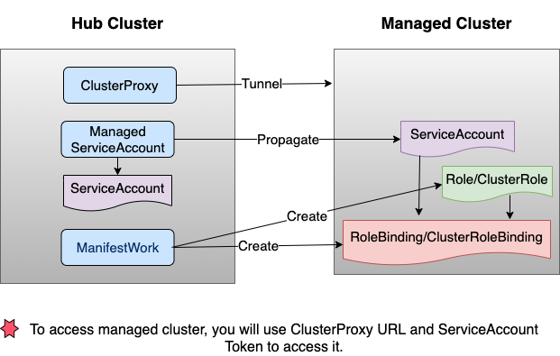

# Multicluster management capability of Ansible via ACM and OCM functionalities

## Goals
- Provide a dynamic inventory of managed clusters that allow the user to select clusters based on criteria such as labels.
- Provide a way to simplify connectivity requirements for automating against multiple kubernetes clusters with Ansible.
- Provide a way for user to request on demand credential and authorization to the managed cluster
- Demonstrate that we can use ACM to improve multicluster management experience on Ansible

## Requirements
- An existing Red Hat Advanced Cluster Management Hub Cluster with OpenShift managed clusters
- ClusterProxy addon is enabled on the Hub Cluster
- ManagedServiceAccount addon is enabled on the Hub Cluster

## Dependencies
Additional python modules ansible, kuberentes, pyyaml, and requests are required and listed in requirements.txt.

## Example automation flow

- User create dynamic inventory file
  - Dynamic inventory file consist of configuration parameters such as 
    - Connection and authentication information to the hub (such as hub kubeconfig)
    - Desire grouping and selection criteria of the groups
- Run playbook to setup ACM and its features
  - Enable ManagedServiceAccount addon 
  - Enable ClusterProxy addon
- User create a playbook to automate against a group of clusters
  - For each of the cluster in a selected group
    - Setup
      - Get cluster-proxy URL from ACM
      - Create a unique ManagedServiceAccount
      - Create Role/RoleBinding to grant permission to ServiceAccount
    - Use Ansible Kubernetes collection to achieve goal of automation
    - Cleanup
      - Delete ManagedServiceAccount
      - Delete Role/RoleBinding

## Example Playbook
- Use dynamic inventory to get a list of OpenShift managed clusters
- Get cluster-proxy URL for the target managed cluster
- Create a unique ManagedServiceAccount for the managed cluster
- Create Role/RoleBinding to grant permission to ServiceAccount
- Create a `test` configMap on `default` namespace on the managed cluster
- Cleanup: delete ManagedServiceAccount on the Hub cluster and this will cause the ServiceAccount and Role/RoleBinding to be deleted on the managed cluster also

**Run the playbook from the project root with the dynamic inventory specified**
- Enter your hub_kubeconfig in `tests/integration/targets/multicluster_management/tasksdynamic-inventory.yml`
- Run the playbook
```
ansible-playbook -i tests/integration/targets/multicluster_management/tasks/dynamic-inventory.yml tests/integration/targets/multicluster_management/tasks/multicluster-management-playbook.yml --extra-vars "target_hosts=ocp-clusters configmap_name=test configmap_namespace=default"
```


